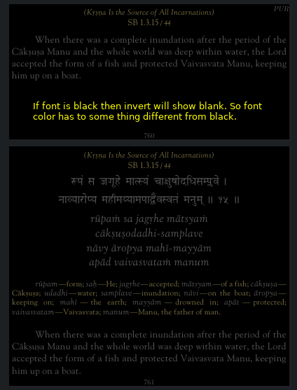
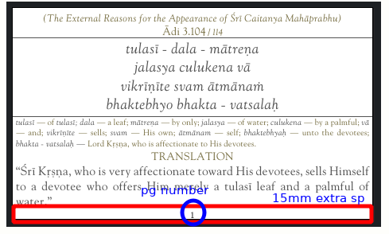
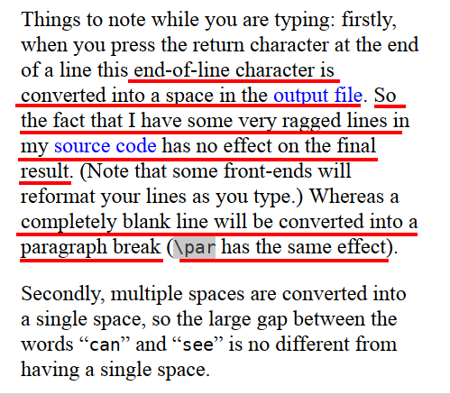
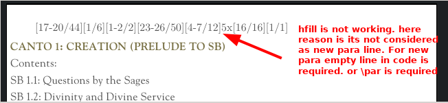
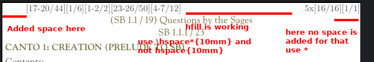
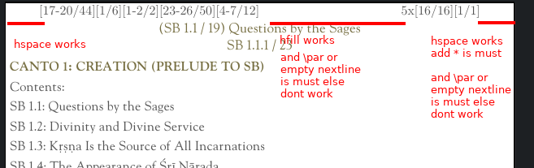

# HOW TO CHANGE PAGE SIZE IN THE MID OF THE DOCUMENT

## METHOD 1 (The following works in PDFLaTeX:)
https://tex.stackexchange.com/a/6838/221200

```latex
\documentclass[parskip=full]{scrartcl}
% this is required for pagenumber and also KOMAoptions to work
\usepackage[automark,headsepline,footsepline]{scrlayer-scrpage}
% the above both are required to show page number 
\usepackage{graphicx}
% the above package is required for includegraphics to work

\usepackage
  [showframe]% to show the page layout
  {geometry}

\begin{document}

\eject \pdfpagewidth=2.5in \pdfpageheight=6.0in
%The above changes the page size but its not sufficient because the margins are not change.
% So using newgeometry we have to readjust the margins and header and footer
\newgeometry{layoutwidth = 2.5in,layoutheight = 6.0in,left=0mm,right=0mm,top=0mm,bottom=0mm,footskip=1mm}
\includegraphics[width=\textwidth,keepaspectratio,page=6]{test123.pdf}
\includegraphics[width=\textwidth,keepaspectratio,page=6]{test123.pdf}
\includegraphics[width=\textwidth,keepaspectratio,page=6]{test123.pdf}

\eject \pdfpagewidth=6in \pdfpageheight=2.5in
\newgeometry{layoutwidth =6in,layoutheight = 2.5in,left=0mm,right=0mm,top=0mm,bottom=0mm,footskip=1mm}
LANDSCAPE

\end{document}
```

# METHOD 2 (using KOMA scripts)
https://tex.stackexchange.com/q/556939/221200

```latex
\documentclass[parskip=full]{scrartcl}
% this is required for pagenumber and also KOMAoptions to work
\usepackage[automark,headsepline,footsepline]{scrlayer-scrpage}
% the above both are required to show page number 
\usepackage{graphicx}
% the above package is required to includegraphics

\usepackage
  [showframe]% to show the page layout
  {geometry}

\begin{document}

\KOMAoptions{paper=2.5in:6.0in,DIV=calc}
\recalctypearea
% The above 2 commands change the page size, but still we have to adjust
% the margins using the below command
\newgeometry{layoutwidth = 2.5in,layoutheight = 6.0in,left=0mm,right=0mm,top=0mm,bottom=0mm,footskip=1mm}
\includegraphics[width=\textwidth,keepaspectratio,page=6]{test123.pdf}
\includegraphics[width=\textwidth,keepaspectratio,page=6]{test123.pdf}
\includegraphics[width=\textwidth,keepaspectratio,page=6]{test123.pdf}

\KOMAoptions{paper=6in:2.5in,DIV=calc,paper=landscape}
%NOTE:
% \KOMAoptions{paper=6in:2.5in,DIV=calc} will not work it will still show 2.5in x 6in
% as per documentation 
% Additionally, the size can also be specified either in the form width :height or in the form
% v3.22 height :width . Which value is taken as the height and which as the width depends on the
% orientation of the paper. With paper=landscape or paper=seascape, the smaller value is
% the height and the larger one is the width . With paper=portrait, the smaller value is the
% width and the larger one is the height .
% I THINK BY DEFAULT IS POTRAIT. So 2.5in x 6in will be shown
% if we want 6in x 2.5in then we have to explicitly mention paper=landscape

\recalctypearea
\newgeometry{layoutwidth =6in,layoutheight = 2.5in,left=0mm,right=0mm,top=0mm,bottom=0mm,footskip=1mm}
LANDSCAPE

\end{document}
```

## METHOD3 (indirect Method)(works only with full pdf page and header and footer)

If we are directly puttin full pdf pages then just have to use `pdfpages` and `fitpaper`. This will resize the papersize as per the page size of that of pdf page 

```latex
\documentclass{article}
\usepackage{pdfpages}
\begin{document}
\includepdfmerge[fitpaper]{./Canto1.pdf, 1}
\includepdfmerge[fitpaper]{./Canto1.pdf, 2}
\end{document}
```

But if we want to add some margin at the bottom then we have to do the following
We have to use the `templatesize={}{}` option first to mention the custom page size we want. This option will fit the page in the center. So if we want 15pt of space after the pdf then we have to use `offset=0,7.5` to push it above so that we have `15pt` at the bottom

Also to have the page number in that 15pt extra space we have to do `\thispagestyle{plain}`

```latex
\documentclass{scrartcl}
\usepackage{pdfpages}
\usepackage{geometry}
\usepackage[automark,headsepline=false,footsepline=false]{scrlayer-scrpage}
\begin{document}

\newgeometry{layoutwidth = 432pt,layoutheight = 207pt,left=0mm,right=0mm,top=0mm, bottom=0mm,footskip=1mm}
\includepdfmerge[offset=0 77.347925,fitpaper,templatesize={432pt}{207pt},pagecommand={\thispagestyle{plain}}]{./test.pdf, 1}

\newgeometry{layoutwidth = 432pt,layoutheight = 404.16207pt,left=0mm,right=0mm,top=0mm, bottom=0mm,footskip=1mm}
\includepdfmerge[offset=0 7.5,fitpaper,templatesize={432pt}{404.16207pt},pagecommand={\thispagestyle{plain}}]{./test.pdf, 2}

\newgeometry{layoutwidth = 432pt,layoutheight = 353.29749pt,left=0mm,right=0mm,top=0mm, bottom=0mm,footskip=1mm}
\includepdfmerge[offset=0 7.5,fitpaper,templatesize={432pt}{353.29749pt},pagecommand={\thispagestyle{plain}}]{./test.pdf, 3}
\end{document}
```


## How it looks


# How to change pdf to night mode or invert its colors

Here i am using a `python` script to generate the `tex` file. The reason is my pdf is of `different page sizes`. So i am using `pdfpages` package along with `fitpaper` option

```python 
from PyPDF2 import PdfFileReader
import re


pdf_file = PdfFileReader(open('./Canto1.pdf', 'rb'))

print("\\documentclass{scrartcl}")
print("\\usepackage{pdfpages}")
print("\\usepackage{geometry}")
print("\\usepackage[automark,headsepline,footsepline]{scrlayer-scrpage}")


print("\\usepackage{xcolor}")
print("\\pagecolor[rgb]{0,0,0}")
print("\\color[RGB]{84,84,84}")

print("\\begin{document}")

cum_pagenum=0
for i in range(pdf_file.getNumPages()):
#for i in range(1,50,1):
    pagenum = i+1
    print("\\includepdfmerge[fitpaper]{./Canto1.pdf, "+str(pagenum)+"}")
print("\\end{document}")
```

Run the code as

```bash
python invert.pdf > invert.tex
pdflatex invert.tex
```

The `invert.tex` file will look like:

```latex
\documentclass{scrartcl}
\usepackage{pdfpages}
\usepackage{geometry}
\usepackage[automark,headsepline,footsepline]{scrlayer-scrpage}
\usepackage{xcolor}
\pagecolor[rgb]{0,0,0}
\color[RGB]{84,84,84}
\begin{document}
\includepdfmerge[fitpaper]{./Canto1.pdf, 1}
\includepdfmerge[fitpaper]{./Canto1.pdf, 2}
\includepdfmerge[fitpaper]{./Canto1.pdf, 3}
\includepdfmerge[fitpaper]{./Canto1.pdf, 4}
\includepdfmerge[fitpaper]{./Canto1.pdf, 5}
\includepdfmerge[fitpaper]{./Canto1.pdf, 6}
\includepdfmerge[fitpaper]{./Canto1.pdf, 7}
\includepdfmerge[fitpaper]{./Canto1.pdf, 8}
\includepdfmerge[fitpaper]{./Canto1.pdf, 9}
\end{document}
```

## HOW IT LOOKS




# HOW TO ADD PAGENUMBERS FOR A PDF FILE

We have a pdf file with different pagesize. We want to add pagenumber at the bottom
We will insert the pdf page using `scrartcl` it will add the page number for the document. For that we add an extra space of 15pt.
`Fitpaper` will center the page on the pagesize mentioned using `templatesize={"+str(width)+"pt}{"+str(height+15)+"pt}`
So we have to offset of 7.5pt using `offset=0 7.5`


```python
from PyPDF2 import PdfFileReader
import re
pdf_file = PdfFileReader(open('./test.pdf', 'rb'))
print("\\documentclass{scrartcl}")
print("\\usepackage{pdfpages}")
print("\\usepackage{geometry}")
print("\\usepackage[automark,headsepline=false,footsepline=false]{scrlayer-scrpage}")

# We want the pagenumber to be of this color. 
# This will set the text color
print("\\usepackage{xcolor}")
print("\\color[RGB]{84,84,84}")

print("\\begin{document}")

for i in range(pdf_file.getNumPages()):
	pagenum = i+1
	height= pdf_file.getPage(i).mediaBox[3] - pdf_file.getPage(i).mediaBox[1]
	width= pdf_file.getPage(i).mediaBox[2] - pdf_file.getPage(i).mediaBox[0]
    print("\\newgeometry{layoutwidth = "+str(width)+"pt,layoutheight = "+str(height+15)+"pt,left=0mm,right=0mm,top=0mm, bottom=0mm,footskip=1mm}")
    print("\\includepdfmerge[offset=0 7.5,fitpaper,templatesize={"+str(width)+"pt}{"+str(height+15)+"pt},pagecommand={\\thispagestyle{scrheadings}}]{./test.pdf, "+str(pagenum)+"}")

print("\\end{document}")
```

Run the code

```sh
python pagenumber.py > pagenumber.tex
pdfplatex pagenumber.tex
```

## HOW IT LOOKS




# IMPORTANT THINGS TO REMEMBER WHILE TYPING OR NEW LINES, SPACES ETC



I wanted to add spacing before and after a para and have `hfill` inbetween. So I was doing

```latex
\hspace{10mm}[17-20/44][1/6][1-2/2][23-26/50][4-7/12]\hfill5x[16/16][1/1]\hspace{10mm}
\includegraphics[width=\textwidth,keepaspectratio,page=1]{test.pdf} (% this is just shown nothing to do with the main problem)
```

This will not treat `\hspace*{10mm}[17-20/44][1/6][1-2/2][23-26/50][4-7/12]\hfill5x[16/16][1/1]\hspace*{10mm}` as a para so it will not work. Because there has to be an empty next line or \par

It will look like



Solution is add \par

```latex
\hspace{10mm}[17-20/44][1/6][1-2/2][23-26/50][4-7/12]\hfill5x[16/16][1/1]\hspace{10mm}\par
\includegraphics[width=\textwidth,keepaspectratio,page=1]{test.pdf}  (% this is just shown nothing to do with the main problem)
```

it will look like



So what works is

```latex
\hspace{10mm}[17-20/44][1/6][1-2/2][23-26/50][4-7/12]\hfill5x[16/16][1/1]\hspace*{10mm}\par  (added star after hspace with \par)
\includegraphics[width=\textwidth,keepaspectratio,page=1]{test.pdf}  (% this is just shown nothing to do with the main problem)
```

it looks like



# How To add a portion of pdf page into a document using includegraphics

```latex
\documentclass[]{scrartcl}
\usepackage{graphicx}
\usepackage[automark,headsepline=false,footsepline=false]{scrlayer-scrpage}
\usepackage[showframe]{geometry}
\usepackage{xcolor}
\color[RGB]{84,84,84}
\begin{document}

% dim of onlyindex_full_sb_no_heading_cropped_4pgs
% height: 355.09240
% width: 432
%RectangleObject([0, 1228.9076, 432, 1584])

% dim of Canto1_only_sloka_top_cropped_1
% height: 32.16000
% width: 432
%RectangleObject([0, 111.84, 432, 144])

% so width = 432
% total height = 355 + 32 + 30(extra space) = 417pt


\KOMAoptions{paper=432pt:417.25240pt,DIV=calc,paper=landscape}
\recalctypearea
\newgeometry{layoutwidth = 432pt,layoutheight = 417.25240pt,left=0mm,right=0mm,top=0mm, bottom=0mm,footskip=1mm}
\parindent=0pt
\hspace{10mm}[17-20/44][1/6][1-2/2][23-26/50][4-7/12]\hfill5x[16/16][1/1]\hspace*{10mm}\par
% note trim 0 0 0 5pt means trim from bottom 5pt. 
% note also use clip else it will overlap
\includegraphics[trim=0 0 0 5pt,clip,width=\textwidth,keepaspectratio,page=1]{/home/simha/latex_includegraphics/full_files_pdf/Canto1_only_sloka_top_cropped_1.pdf}
\includegraphics[width=\textwidth,keepaspectratio,page=1]{/home/simha/latex_includegraphics/full_files_pdf/onlyindex_full_sb_no_heading_cropped_4pgs.pdf}

\end{document}
```

HOw it looks


# pdfpages fitpaper: it will fit the image to paper size but keep scale=1 only

The following code will create a pdf with 400pt x 400p

```
\documentclass[version=3.21]{scrartcl}
\usepackage{pdfpages}
\usepackage[showframe]{geometry}
\usepackage[automark,headsepline=false,footsepline=false]{scrlayer-scrpage}
\setlength{\parindent}{0pt}
\setlength{\parskip}{0pt}
\setlength{\baselineskip}{0pt}
\begin{document}
\KOMAoptions{paper=400pt:400pt,DIV=calc}
\recalctypearea
\newgeometry{layoutwidth =400pt,layoutheight =400pt,left=0mm,right=0mm,top=0mm, bottom=0mm}
\thispagestyle{empty}
Sampe Some text
\end{document}
```


The following code create a pdf of page size 600pt x 600pt and include the pdf which is 400ptx 400pt
we see that it does not scale to 600ptx600pt rather remains 400ptx400pt

```
\documentclass[version=3.21]{scrartcl}
\usepackage{pdfpages}
\usepackage{geometry}
\usepackage[automark,headsepline=false,footsepline=false]{scrlayer-scrpage}
\setlength{\parindent}{0pt}
\setlength{\parskip}{0pt}
\setlength{\baselineskip}{0pt}
\begin{document}
\includepdfmerge[fitpaper,templatesize={300pt}{300pt},pagecommand={\thispagestyle{empty}}]{testing.pdf,1}
\end{document}
```


**Solution is it use scale:**
the scale option is not mentioned in the documentation of the pdfpages, but it works.

Calculate scale as 600/400 = 1.5

```
\includepdfmerge[scale=1.5,fitpaper,templatesize={300pt}{300pt},pagecommand={\thispagestyle{empty}}]{testing.pdf,1}
```

https://tex.stackexchange.com/questions/563042/pdfpages-not-scaling-the-pdf-when-fitpaper-is-true


# Q: pdflatex: filesize of pdf generated using includepdfmerge(pdf-pages) is much smaller that includegraphics
https://tex.stackexchange.com/questions/562575/pdflatex-filesize-of-pdf-generated-using-includepdfmergepdf-pages-is-much-sma/562670#562670

**SOLUTION**
For the sake of stopping fonts getting embedded everypage due to includegraphics we have to store the pdf once in temporary box to trigger the font optimization.

It can be done using
```
\documentclass{article}
\usepackage{graphicx}
\pagestyle{empty}
\makeatletter
\setbox\@tempboxa=\hbox{\includegraphics{example-image-a4-numbered}}% font is included only once
\makeatother
\begin{document}

\includegraphics[width=\textwidth,keepaspectratio,page=1]{example-image-a4-numbered}%
\newpage
\includegraphics[width=\textwidth,keepaspectratio,page=2]{example-image-a4-numbered}%
\newpage
\includegraphics[width=\textwidth,keepaspectratio,page=3]{example-image-a4-numbered}%
\newpage
\includegraphics[width=\textwidth,keepaspectratio,page=4]{example-image-a4-numbered}%
\newpage
\includegraphics[width=\textwidth,keepaspectratio,page=5]{example-image-a4-numbered}%
\end{document}
```

Example used in Adi
```
\documentclass[version=3.21]{scrartcl}
\usepackage{pdfpages}
\usepackage{geometry}
\usepackage[automark,headsepline=false,footsepline=false]{scrlayer-scrpage}
\usepackage{xcolor}
\color[RGB]{84,84,84}
\ohead{PUR}
\makeatletter
\setbox\@tempboxa=\hbox{\includegraphics{./CC/CHBRK_LATEST/DOCS_AND_PDFS/Adi_only_chp_brk_cropped.pdf}}
\setbox\@tempboxa=\hbox{\includegraphics{./CC/CHBRK_LATEST/DOCS_AND_PDFS/FULL_CHAP_BREAKUP_cropped.pdf}}
\setbox\@tempboxa=\hbox{\includegraphics{./CC/Adi/guru/translation_up/Adi_cropped.pdf}}
\setbox\@tempboxa=\hbox{\includegraphics{./CC/CHBRK_LATEST/DOCS_AND_PDFS/only_sloka_top/Adi_only_chp_brk_cropped.pdf}}
\makeatother
\begin{document}
%RectangleObject([0, 575.24002, 432, 1080])
\newgeometry{layoutwidth = 432pt,layoutheight = 372pt,left=0mm,right=0mm,top=0mm, bottom=0mm,footskip=1mm}
\includepdfmerge[offset=0 90.0,fitpaper,trim=0 312.75998pt 0 0, clip,templatesize={432pt}{372pt},pagecommand={\thispagestyle{plain}}]{./CC/Adi/guru/translation_up/Adi_cropped.pdf, 1}
\newgeometry{layoutwidth = 432pt,layoutheight = 372pt,left=0mm,right=0mm,top=0mm, bottom=0mm,footskip=1mm}
\includepdfmerge[offset=0 90.0,fitpaper,trim=0 136.75998pt 0 176pt, clip,templatesize={432pt}{372pt},pagecommand={\thispagestyle{plain}}]{./CC/Adi/guru/translation_up/Adi_cropped.pdf, 1}
\newgeometry{layoutwidth = 432pt,layoutheight = 372pt,left=0mm,right=0mm,top=0mm, bottom=0mm,footskip=1mm}
\includepdfmerge[offset=0 109.62001,fitpaper,trim=0 0 0 352pt, clip,templatesize={432pt}{372pt},pagecommand={\thispagestyle{plain}}]{./CC/Adi/guru/translation_up/Adi_cropped.pdf, 1}
%sed -i 's@BookmarkPageNumber: 1$@BookmarkPageNumberXYZ: 1@g' dump_data_CantoAdi_raw_translation_above.txt;
\KOMAoptions{paper=432pt:510.43013pt,DIV=calc}
\recalctypearea
\newgeometry{layoutwidth = 432pt,layoutheight = 510.43013pt,left=0mm,right=0mm,top=0mm, bottom=0mm,footskip=1mm}
\includegraphics[width=\textwidth,keepaspectratio,page=1]{/home/simha_personal_data/Books_made/NCD_CC/CHBRK_LATEST/DOCS_AND_PDFS/only_sloka_top/Adi_only_chp_brk_cropped.pdf}
\includegraphics[width=\textwidth,keepaspectratio,page=1]{/home/simha_personal_data/Books_made/NCD_CC/CHBRK_LATEST/DOCS_AND_PDFS/FULL_CHAP_BREAKUP_cropped.pdf}
\KOMAoptions{paper=432pt:552.17748pt,DIV=calc}
\recalctypearea
\newgeometry{layoutwidth = 432pt,layoutheight = 552.17748pt,left=0mm,right=0mm,top=0mm, bottom=0mm,footskip=1mm}
\includegraphics[width=\textwidth,keepaspectratio,page=1]{/home/simha_personal_data/Books_made/NCD_CC/CHBRK_LATEST/DOCS_AND_PDFS/only_sloka_top/Adi_only_chp_brk_cropped.pdf}
\includegraphics[width=\textwidth,keepaspectratio,page=2]{/home/simha_personal_data/Books_made/NCD_CC/CHBRK_LATEST/DOCS_AND_PDFS/FULL_CHAP_BREAKUP_cropped.pdf}
%sloka_page: 1
%RectangleObject([0, 195.36001, 432, 288])
\newgeometry{layoutwidth = 432pt,layoutheight = 272.63999pt,left=0mm,right=0mm,top=0mm, bottom=0mm,footskip=1mm}
\includepdfmerge[offset=0 90.0,fitpaper,templatesize={432pt}{272.63999pt},pagecommand={\thispagestyle{plain}}]{/home/simha_personal_data/Books_made/NCD_CC/CHBRK_LATEST/DOCS_AND_PDFS/Adi_only_chp_brk_cropped.pdf, 1}
\ihead{\hspace{5mm}[1/4][1/14]}
\ohead{}
\newgeometry{layoutwidth = 432pt,layoutheight = 459.63997pt,left=0mm,right=0mm,top=0mm, bottom=0mm,footskip=1mm,headsep=-12mm}
\includepdfmerge[offset=0 90.0,fitpaper,templatesize={432pt}{459.63997pt},pagecommand={\thispagestyle{scrheadings}}]{/home/simha_personal_data/Books_made/NCD_CC/Adi/guru/translation_up/Adi_cropped.pdf, 27}
\end{document}
```


