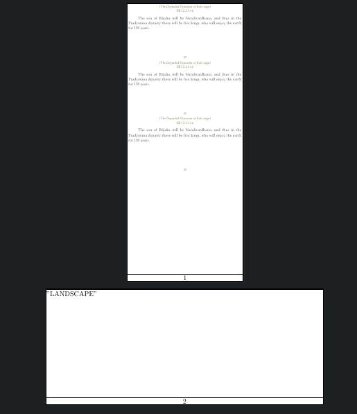

# HOW TO CHANGE PAGE SIZE IN THE MID OF THE DOCUMENT

## METHOD 1 (The following works in PDFLaTeX:)
https://tex.stackexchange.com/a/6838/221200

```latex
\documentclass[parskip=full]{scrartcl}
% this is required for pagenumber and also KOMAoptions to work
\usepackage[automark,headsepline,footsepline]{scrlayer-scrpage}
% the above both are required to show page number 
\usepackage{graphicx}
% the above package is required for includegraphics to work

\usepackage
  [showframe]% to show the page layout
  {geometry}

\begin{document}

\eject \pdfpagewidth=2.5in \pdfpageheight=6.0in
%The above changes the page size but its not sufficient because the margins are not change.
% So using newgeometry we have to readjust the margins and header and footer
\newgeometry{layoutwidth = 2.5in,layoutheight = 6.0in,left=0mm,right=0mm,top=0mm,bottom=0mm,footskip=1mm}
\includegraphics[width=\textwidth,keepaspectratio,page=6]{test123.pdf}
\includegraphics[width=\textwidth,keepaspectratio,page=6]{test123.pdf}
\includegraphics[width=\textwidth,keepaspectratio,page=6]{test123.pdf}

\eject \pdfpagewidth=6in \pdfpageheight=2.5in
\newgeometry{layoutwidth =6in,layoutheight = 2.5in,left=0mm,right=0mm,top=0mm,bottom=0mm,footskip=1mm}
LANDSCAPE

\end{document}
```

# METHOD 2 (using KOMA scripts)
https://tex.stackexchange.com/q/556939/221200

```latex
\documentclass[parskip=full]{scrartcl}
% this is required for pagenumber and also KOMAoptions to work
\usepackage[automark,headsepline,footsepline]{scrlayer-scrpage}
% the above both are required to show page number 
\usepackage{graphicx}
% the above package is required to includegraphics

\usepackage
  [showframe]% to show the page layout
  {geometry}

\begin{document}

\KOMAoptions{paper=2.5in:6.0in,DIV=calc}
\recalctypearea
% The above 2 commands change the page size, but still we have to adjust
% the margins using the below command
\newgeometry{layoutwidth = 2.5in,layoutheight = 6.0in,left=0mm,right=0mm,top=0mm,bottom=0mm,footskip=1mm}
\includegraphics[width=\textwidth,keepaspectratio,page=6]{test123.pdf}
\includegraphics[width=\textwidth,keepaspectratio,page=6]{test123.pdf}
\includegraphics[width=\textwidth,keepaspectratio,page=6]{test123.pdf}

\KOMAoptions{paper=6in:2.5in,DIV=calc,paper=landscape}
%NOTE:
% \KOMAoptions{paper=6in:2.5in,DIV=calc} will not work it will still show 2.5in x 6in
% as per documentation 
% Additionally, the size can also be specified either in the form width :height or in the form
% v3.22 height :width . Which value is taken as the height and which as the width depends on the
% orientation of the paper. With paper=landscape or paper=seascape, the smaller value is
% the height and the larger one is the width . With paper=portrait, the smaller value is the
% width and the larger one is the height .
% I THINK BY DEFAULT IS POTRAIT. So 2.5in x 6in will be shown
% if we want 6in x 2.5in then we have to explicitly mention paper=landscape

\recalctypearea
\newgeometry{layoutwidth =6in,layoutheight = 2.5in,left=0mm,right=0mm,top=0mm,bottom=0mm,footskip=1mm}
LANDSCAPE

\end{document}
```
## How it looks



# How to change pdf to night mode or invert its colors

Here i am using a `python` script to generate the `tex` file. The reason is my pdf is of `different page sizes`. So i am using `pdfpages` package along with `fitpaper` option


```python 
from PyPDF2 import PdfFileReader
import re


pdf_file = PdfFileReader(open('./Canto1.pdf', 'rb'))

print("\\documentclass{scrartcl}")
print("\\usepackage{pdfpages}")
print("\\usepackage{geometry}")
print("\\usepackage[automark,headsepline,footsepline]{scrlayer-scrpage}")


print("\\usepackage{xcolor}")
print("\\pagecolor[rgb]{0,0,0}")
print("\\color[RGB]{84,84,84}")

print("\\begin{document}")

cum_pagenum=0
for i in range(pdf_file.getNumPages()):
#for i in range(1,50,1):
    pagenum = i+1
    print("\\includepdfmerge[fitpaper]{./Canto1.pdf, "+str(pagenum)+"}")
print("\\end{document}")
```

Run the code as

```bash
python invert.pdf > invert.tex
```

The invert.tex file will look like:

```latex
\documentclass{scrartcl}
\usepackage{pdfpages}
\usepackage{geometry}
\usepackage[automark,headsepline,footsepline]{scrlayer-scrpage}
\usepackage{xcolor}
\pagecolor[rgb]{0,0,0}
\color[RGB]{84,84,84}
\begin{document}
\includepdfmerge[fitpaper]{./Canto1.pdf, 1}
\includepdfmerge[fitpaper]{./Canto1.pdf, 2}
\includepdfmerge[fitpaper]{./Canto1.pdf, 3}
\includepdfmerge[fitpaper]{./Canto1.pdf, 4}
\includepdfmerge[fitpaper]{./Canto1.pdf, 5}
\includepdfmerge[fitpaper]{./Canto1.pdf, 6}
\includepdfmerge[fitpaper]{./Canto1.pdf, 7}
\includepdfmerge[fitpaper]{./Canto1.pdf, 8}
\includepdfmerge[fitpaper]{./Canto1.pdf, 9}
\end{document}
```
